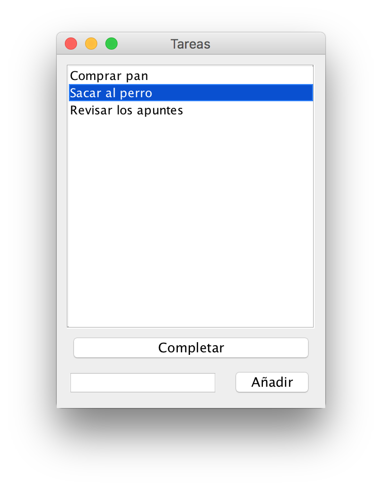

# Ejercicio 1 - Tareas

Crea una aplicación que permita mantener una lista de tareas pendientes.

Algunas sugerencias y restricciones:

- De cada tarea almacenamos el título y si está completada o no.
- La aplicación está contruída con Swing y permitirá ver las tareas pendientes, añadir nuevas tareas y marcar tareas como completadas.
- Tiene que utilizar un [JList](https://docs.oracle.com/javase/tutorial/uiswing/components/list.html) para mostrar las tareas.
- Como mecanismo de persistencia, utiliza un archivo JSON que se carga al iniciar la aplicación y se vuelca a disco al cerrarla.
