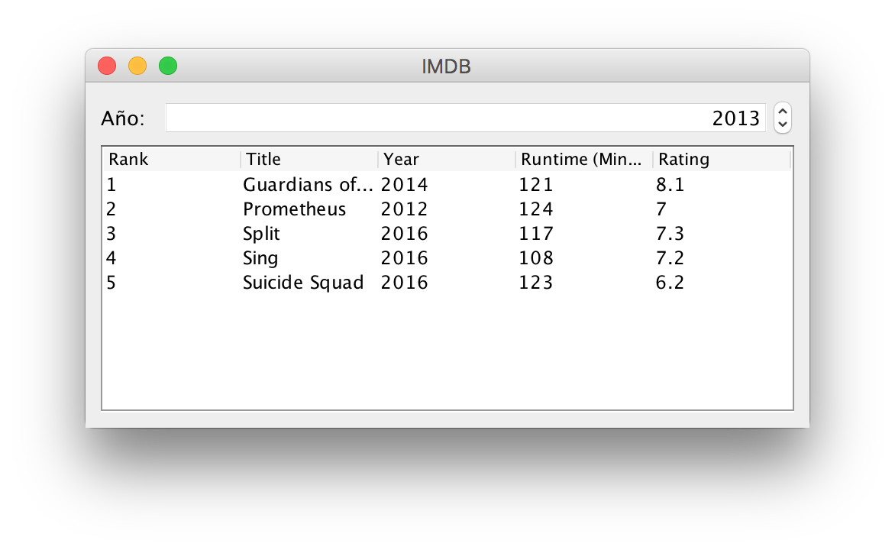

# Ejercicio 2 - IMDB

Crea una aplicación con interfaz de usuario como el de la imagen:

Permitirá seleccionar mediante un [JSpinner](https://docs.oracle.com/javase/tutorial/uiswing/components/spinner.html) un año concreto y mostrará en un [JTable](https://docs.oracle.com/javase/tutorial/uiswing/components/table.html) la información de las 10 mejores películas de ese año según IMDB.

La información necesaria está disponible en este [_dataset_](imdb-data-from-2006-to-2016.zip), descargado desde [Kaggle](https://www.kaggle.com/PromptCloudHQ/imdb-data).
