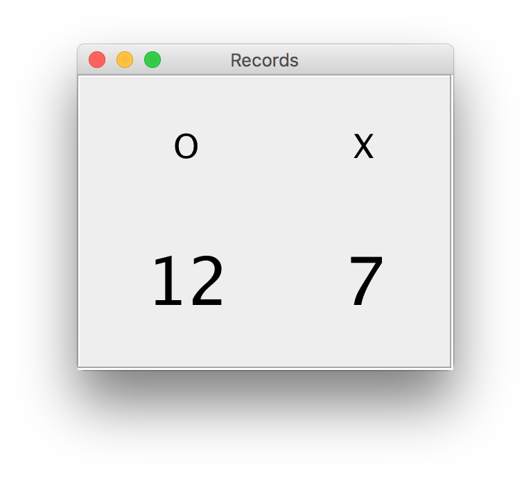

# Ejercicio 3 - Records

Queremos añadir una nueva ventana a nuestra aplicación de tres en raya en la que llevemos un recuento de las partidas que ha ganado el jugador O y las que ha ganado el jugador X.

Además, el recuento se mantendrá entre sesiones utilizando una base de datos SQLite.
